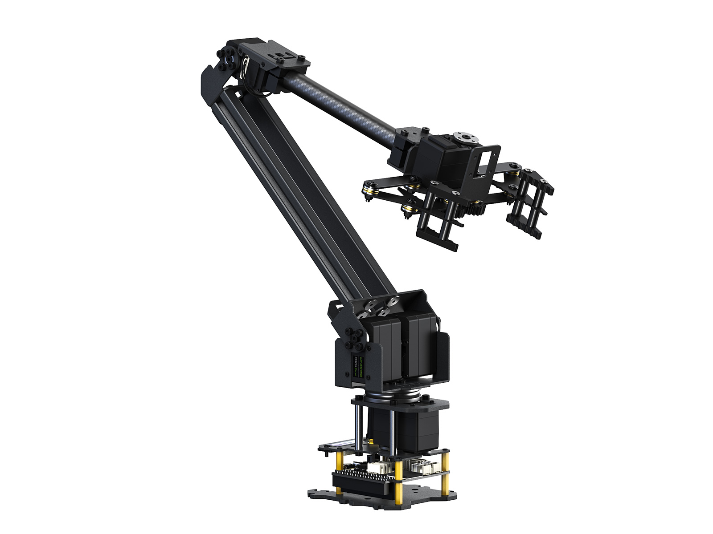

# Waveshare Roarm SDK


This is a python API for serial or http communication with waveshare roarm and controlling it.

| Series | Models | Image |
|--------|--------|-------|
| RoArm-M2 | [**RoArm-M2-S**](https://www.waveshare.com/roarm-m2-s.htm), [**RoArm-M2-Pro**](https://www.waveshare.com/roarm-m2-s.htm) | <a href="https://www.waveshare.com/roarm-m2-s.htm"></a> |
| RoArm-M2 | [**RoArm-M2-GA**](https://www.waveshare.com/roarm-m2-ga.htm) | <a href="https://www.waveshare.com/roarm-m2-ga.htm"></a> |
| RoArm-M3 | [**RoArm-M3-S**](https://www.waveshare.com/roarm-m3.htm), [**RoArm-M3-Pro**](https://www.waveshare.com/roarm-m3.htm) | <a href="https://www.waveshare.com/roarm-m3.htm"></a> |

Model mapping:

- **RoArm-M2-S / RoArm-M2-Pro**: `roarm_type="roarm_m2"`, `gripper_type="angular_direct"` (default)
- **RoArm-M2-GA**: `roarm_type="roarm_m2"`, `gripper_type="angular_gear"`
- **RoArm-M3-S / RoArm-M3-Pro**: `roarm_type="roarm_m3"` (single gripper type; `gripper_type` usually omitted)

## Installation
### Pip install

```bash
pip install roarm-sdk==0.1.1
```

### Source code

```bash
git clone https://github.com/waveshareteam/waveshare_roarm_sdk.git <your-path>
cd <your-path>/waveshare_roarm_sdk
# Install
[sudo] python2 setup.py install
# or
[sudo] python3 setup.py install
```

## Usage:

```python
from roarm_sdk.roarm import roarm

# for roarm_m2 Serial communication example
roarm = roarm(roarm_type="roarm_m2", port="/dev/ttyUSB0", baudrate=115200)

# for roarm_m3 Serial communication example
#roarm = roarm(roarm_type="roarm_m3", port="/dev/ttyUSB0", baudrate=115200)

# Optional: gripper type and debug
# gripper_type: "angular_direct" (default, invert gripper) or "angular_gear" (pass-through)
# debug: False (default, no print) or True (print TX/RX data)
# RoArm-M2-GA example:
#roarm = roarm(roarm_type="roarm_m2", port="/dev/ttyUSB0", baudrate=115200, gripper_type="angular_gear", debug=True)
```

Constructor notes:

- **gripper_type** – `"angular_direct"` (default) or `"angular_gear"`. Default keeps legacy invert behavior; `angular_gear` sends/reads gripper values without invert. Omit it for backward compatibility.
- **RoArm-M2-GA** – use `roarm_type="roarm_m2"` with `gripper_type="angular_gear"`.
- **debug** – `False` (default) or `True`. When `True`, print serial/HTTP payload data.
- **host** – HTTP mode is **control-only** (send commands). Use serial for feedback reads and drag teach.

The [`demo`](./demo) directory stores some test case files.

## Smooth-motion demo (RoArm M3-S)

`smooth_joint_demo.py` runs a small, hardware-safe A -> B -> C -> A motion loop.
It reads the joints first and aborts before any motion unless six finite values
are returned and the first five joints are within 0.25 rad of home `[0, 0, pi/2, 0, 0]`;
the measured gripper value is preserved unchanged. Every move is a single
all-joints command (`joints_radian_ctrl`); arrival is confirmed by polling
`joints_radian_get` (max error <= 0.08 rad) against a conservative timeout.
Ctrl+C stops the loop without releasing torque.

```bash
# defaults: COM21, 115200 baud, speed 180, acc 10, 2 cycles
python smooth_joint_demo.py
python smooth_joint_demo.py --port COM5 --speed 300 --cycles 1
```

Tests run without hardware: `python -m unittest discover -s tests -v`

## Large-motion demo (RoArm M3-S)

`large_motion_demo.py` runs mesh-checked and physically validated large poses
in absolute degree space. The route is A -> B -> C -> D -> B -> A -> H ->
A -> G -> F, where A/F are home, B is high-right, C/D are high-left-open
with roll +180/-180 and the gripper open at 90 degrees, H exercises elbow
135 degrees, and G exercises positive wrist pitch. Home separates H and G.
It reads the joints first and aborts before any motion unless six finite
values are returned, the first five joints are within 0.25 rad of home
`[0, 0, pi/2, 0, 0]` and the gripper is within 0.25 rad of closed. Every
move is a single all-joints command (`joints_radian_ctrl`); arrival
requires max error <= 0.12 rad with 3 consecutive stable samples
(<= 0.015 rad step). Live firmware XYZ enforces a 120 mm tool-height guard;
an emergency hold never releases torque. Ordinary timeouts also hold the
measured joints before disconnecting. Timeouts include the worst measured
post-roll slowdown, and a one-second inter-pose dwell lets the stock controller
finish each sustained move before accepting the next. The validated full route
also pauses 30 seconds after the full roll and 10 seconds at the following home
pose because sustained testing caused a temporary controller/servo slowdown.
The firmware also intermittently ignored a post-roll command, so the script
probes for motion after two seconds and retries the identical target once only
when no joint moved. Ctrl+C leaves torque enabled.

```bash
# stage-only: A -> B -> F, test the riskiest pitch/base excursion and return home
python large_motion_demo.py --stage-only

# full validated run (includes +/-90 base, +/-45 pitch, 360 roll, open gripper)
python large_motion_demo.py

# defaults: COM21, 115200 baud, speed 180, acc 10
python large_motion_demo.py --port COM5 --speed 120
```

You can find out which interfaces roarm_sdk provides in [`./doc/README.md`](./doc/README.md).

   

[roarm_m2 api 说明](./doc/roarm_m2_zh.md) | [roarm_m2 api Description](./doc/roarm_m2_en.md)

[roarm_m3 api 说明](./doc/roarm_m3_zh.md) | [roarm_m3 api Description](./doc/roarm_m3_en.md)
